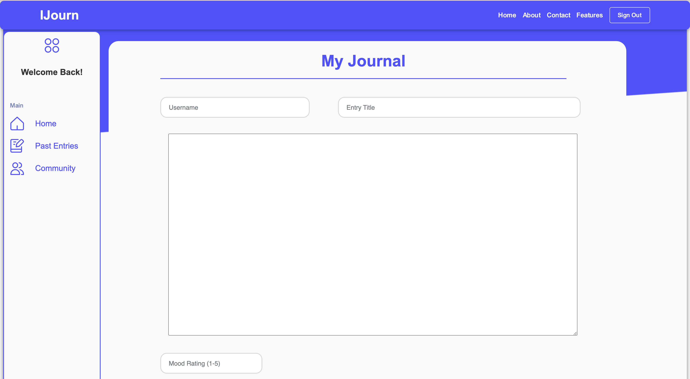

# IJourn

## Description

IJourn is a project that I developed to give myself and others a quick and easy way to journal. Expressive writing through journaling can be a powerful way to process stress, trauma, or any other emotion. However, traditional journaling can sometimes be difficult, hence the existence of IJourn.

## Overview

`index.js` is the main server file for a Node.js application using the Express framework. The application handles journal entries and user management, including authentication and session management. It utilizes a MongoDB database through Mongoose models (`model.js`) for storing and querying data.

The application exposes several RESTful API endpoints for operations such as creating, retrieving, updating, and deleting journal entries and users, as well as handling sessions and authentication.

## Table of Contents

1. [Setup and Configuration](#setup-and-configuration)
2. [Middlewares](#middlewares)
3. [API Endpoints](#api-endpoints)
   - [Journal Entries](#journal-entries)
   - [Users](#users)
   - [Session Management](#session-management)
4. [Server Initialization](#server-initialization)

## DataBase

### Attributes

#### Journal

- username (string)
- entryTitle (string)
- entryBody (string)
- entryDate (string)
- entryTime (string)
- moodRating (int)
- public (boolean)

#### User

- firstName (string)
- lastName (string)
- username (string)
- encryptedPassword (string)
- email (string)

## Setup and Configuration

### Dependencies

- **cors**: Middleware to enable CORS (Cross-Origin Resource Sharing).
- **express**: Web framework for Node.js.
- **express-session**: Middleware to handle sessions in Express.
- **model**: Custom module for database models.

### Initialization and Middleware Setup

```javascript
const cors = require('cors');
const express = require('express');
const session = require('express-session');
const model = require('./model');
const app = express();

app.use(express.static("public"));
app.use(session({
    secret: "13rough134u9hoi1nqrvu14p398hgiu1oniup43789quc",
    saveUninitialized: true,
    resave: false,
}));
app.use(express.urlencoded({ extended: false }));
app.use(cors());
```

### Key Configuration

- **Static Files**: Serves static files from the `public` directory.
- **Session**: Configured with a secret for signing the session ID cookie, not initialized until session data is modified, and not resaved back to the session store if not modified.
- **Body Parsing**: Parses incoming request bodies in URL-encoded format.
- **CORS**: Allows all domains to access the API.

## Middlewares

### Authorization Middlewares

- **`authorizeRequest`**: Checks if a user is authenticated by verifying session data and user ID. It retrieves the user from the database and attaches the user object to the request for use in subsequent middleware or routes.

```javascript
function authorizeRequest(request, response, next) {
    if (request.session && request.session.userId) {
        model.User.findOne({ _id: request.session.userId }).then(function(user) {
            if (user) {
                request.user = user;
                next();
            } else {
                response.status(401).json({error: "Not authenticated", reason: "Session ID missing or invalid"});
            }
        });
    } else {
        response.status(401).json({error: "Not authenticated", reason: "Session ID missing or invalid"});
    }
}
```

## API Endpoints

Name                        | Method | Path
----------------------------|--------|------------------
Retrieve journal collection | GET    | /journals
Create a new journal entry  | POST   | /journals
Delete a journal entry      | DELETE | /journals/id
Update a specific journal entry | PUT | /journals/:journalID
Get a list of all journal entries that are made public | GET | /journals/community
Get a list of all users | GET | /users
Get or find a specific user | GET | /users/:userID
Create a new user account | POST | /users
Update a users account | PUT | /users/:userID
Delete a users account | DELETE | /users/:userID
Log a user in with a session | POST | /session
Log a user out | DELETE | /session

### Journal Entries

#### Retrieve All Journal Entries

**GET** `/journals`

- Requires authorization.
- Retrieves all journal entries belonging to the authenticated user, sorted by entry date.

```javascript
app.get("/journals", authorizeRequest, function(request, response) {
    const userId = request.session.userId;
    let filter = { user: userId };
    let order = { entryDate: -1 };
    model.Journal.find(filter).sort(order).then((journals) => {
        response.json(journals);
    });
});
```

#### Create a New Journal Entry

**POST** `/journals`

- Requires authorization.
- Creates a new journal entry with data from the request body.

```javascript
app.post("/journals", authorizeRequest, function(request, response) {
    const newJournal = new model.Journal({ ...request.body, user: request.session.userId });
    newJournal.save().then(() => {
        response.status(201).send("Created. New Journal entry added.");
    });
});
```

### Users

#### Retrieve All Users

**GET** `/users`

- Publicly accessible.
- Retrieves all users from the database.

```javascript
app.get("/users", function(request, response) {
    model.User.find().then((users) => {
        response.json(users);
    });
});
```

### Session Management

#### Create Session

**POST** `/session`

- Publicly accessible.
- Authenticates a user and creates a session.

```javascript
app.post("/session", function (request, response) {
    model.User.findOne({ email: request.body.email }).then(function (user) {
        user.verifyEncryptedPassword(request.body.plainPassword).then(function (match) {
            if (match) {
                request.session.userId = user._id;
                response.status(201).send("Authenticated");
            } else {
                response.status(401).send("Invalid email or password");
            }
        });
    });
});
```

## Server Initialization

Starts the server on port 8080.

```javascript
app.listen(8080, function() {
    console.log("Server is running...");
});
```

This documentation provides a thorough overview of the functionality provided by `index.js`, supporting the development and maintenance of the application.

### Image

#### Home Page


#### Dashboard


